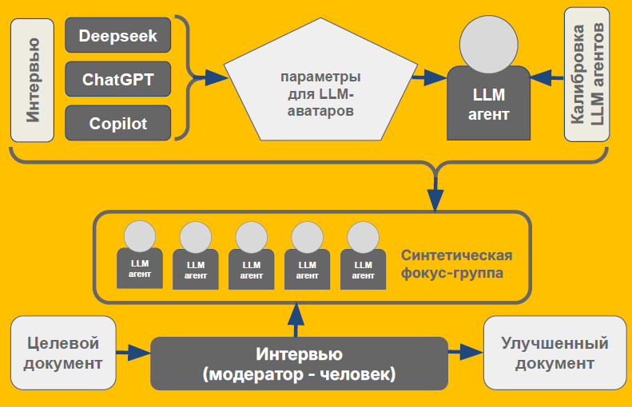
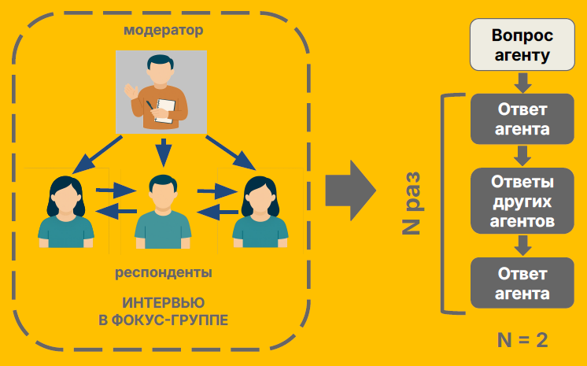

# Агенты LLM для прогнозирования общественного мнения о центральных банках




Фреймворк для создания синтетических фокус-групп на основе LLM-агентов с персонализированными характеристиками. Позволяет моделировать обсуждение документов ЦБ и анализировать динамику доверия к институтам.

# Структура проекта

## Основные модули

agent.py - класс Agent, представляющий участника фокус-группы

focus_group.py - класс FocusGroup для управления группой агентов

model.py - абстрактный класс Model и реализация YandexModel

main.py - точка входа для запуска системы

text.txt - пример текста для обсуждения

log.txt - пример лога обсуждения

## Директории

avatars/ - JSON-файлы с характеристиками агентов

interviews/ - текстовые файлы интервью для автоматического препроцессинга


# Быстрый старт 

## Установка и настройка

### 1. Требования
- Python 3.8+
- Аккаунт [Yandex Cloud](https://yandex.cloud/ru/) с API-ключом для YandexGPT
- (Опционально) Аккаунт [OpenRouter](https://openrouter.ai/) для альтернативных моделей

### 2. Установка
```bash
git clone https://github.com/SmartBerry31415/LLM-agents-for-forecasting-public-perceptions-of-CB.git
cd <project-directory>
```

### 3. Установка зависимостей
```python
pip install requests
```

### 4. Настройка API
Получите API-ключ и Folder ID в Yandex Cloud
Замените значения в main.py

```python
YC_FOLDER_ID = "your_actual_folder_id"
YC_API_KEY = "your_actual_api_key"
```

## Использование

### Базовый запуск

1. Если имеются готовые аватары (наборы параметров в формате json), поместите их в папку avatars либо укажите путь к любой другой папке, в которой они находятся.  

```python 
from focus_group import FocusGroup
from model import YandexModel

MODEL_NAME = "yandexgpt"
YC_FOLDER_ID = "your_folder_id" # YOUR YANDEX FOLDER ID
YC_API_KEY = "your_api_key" # YOUR YANDEX API KEY
MODEL_URL = "https://llm.api.cloud.yandex.net/foundationModels/v1/completion"

model = YandexModel(MODEL_NAME, MODEL_URL, YC_API_KEY, YC_FOLDER_ID)
focus_group = FocusGroup(
    model_for_preprocessing=None,
    use_auto_preprocessing=False,
    interviews_path=None,
    avatars_path="avatars", # FOLDER WITH AVATARS HERE
    iterations=2
)

print(focus_group.add_agents(model))
focus_group.conduct_interview("text.txt", "log.txt")
```
Successfully added 10 agents.

Your synthetic focus group consists of 10 respondents.

The interview will be conducted with 2 iterations.

Interview starts now. To terminate the interview, enter END

Enter your question for the focus group: Как вы считаете, этот текст понятен широкой публике?

Wait...

Модератор: Как вы считаете, этот текст понятен широкой публике?Текст, с которым ты работаешь: Банк России с 2026 года отменяет трехлетнюю периодичность проверок

Регулятор внес изменения в инструкцию о порядке проведения проверок поднадзорных лиц. Одна из основных новаций – отмена обязательной трехлетней периодичности проверок.<...>

Константин: Непонятно всё это. Я даже не знаю, зачем такие проверки нужны и как они влияют на жизнь обычных людей. Раньше всё было проще.

Глеб: Текст изложен в доступной форме, однако для широкой публики могут быть непонятны специфические термины, такие как <...>

Виктория: Текст в целом понятен, но для широкой публики может быть слишком специализированным. Непонятно, как именно отмена трёхлетней периодичности проверок повлияет <...>

<...>

SYSTEM: Iteration 2

Константин: Этот текст для обычного человека сложен. Слишком много специальных терминов, неясно, как изменения отразятся на жизни людей. Раньше всё было проще, а сейчас читаешь и не понимаешь, о чём речь.

Михаил: Текст понятен, но для широкой публики он, скорее всего, будет слишком специализированным. В нём много терминов <...>

Алексей: Текст понятен в общих чертах, но для широкой публики он может показаться слишком специализированным <...>

<...>

Enter your question for the focus group: END

Interview terminated. Results saved to: log.txt
```
В базовом варианте интервью проводится в интерактивном режиме:


```
2. Если необходимо предварительно создать аватары из текстов интервью (текстовые файлы в формате txt), поместите тексты интервью в папку interviews либо укажите путь к любой другой папке, в которой они находятся. 

```python 
from focus_group import FocusGroup
from model import YandexModel

MODEL_NAME = "yandexgpt"
YC_FOLDER_ID = "your_folder_id" # YOUR YANDEX FOLDER ID
YC_API_KEY = "your_api_key" # YOUR YANDEX API KEY
MODEL_URL = "https://llm.api.cloud.yandex.net/foundationModels/v1/completion"

model = YandexModel(MODEL_NAME, MODEL_URL, YC_API_KEY, YC_FOLDER_ID)
focus_group = FocusGroup(
    model_for_preprocessing=model,
    use_auto_preprocessing=True,
    interviews_path="interviews", # INTERVIEWS PATH HERE
    avatars_path="avatars", 
    iterations=2
)

print(focus_group.add_agents(model))
focus_group.conduct_interview("text.txt", "log.txt")
```

В текущем пайплайне аватары имеют следющие параметры:
```
{
  "name": "Angelina",
  "age": 38,
  "profession": "Банковский служащий",
  "sentiment": 0.65,
  "traits": "Прагматичная, критичная, заботящаяся о семье",
  "concerns": "Отрыв цен от зарплат, недоступность жилья, рост цен на продукты",
  "key_phrases": "Остановите рост цен, снизите ставки",
  "communication_style": "Эмоциональные сравнения, примеры из семейного бюджета",
  "economic_view": "Фокусируется на покупательной способности семьи",
  "trust_in_institutions": 0.7,
  "knowledge_level": "Практический (работа в банковской сфере)",
  "financial_behavior": "Планирует крупные покупки с учетом сезонных изменений цен",
  "policy_priority": "Снижение ставок по кредитам, контроль цен на продукты",
  "cb_functions_understanding": "Установка ставок, регулирование банков, борьба с инфляцией",
  "cb_perception": "Признает усилия ЦБ в сложных условиях, но ждет более ощутимых результатов",
  "cb_trust_factors": "Конкретные обещания и их выполнение",
  "information_sources": "Новостные ленты, интернет-поисковики",
  "emotional_tone": "Обеспокоенный, критичный с элементами надежды"
}
```
Полученные параметры аватаров сохрянются в виде json файлов в папку `avatars`.

3. Фреймворк также предусматривает проведение интервью в автоматическом режиме. Для этого вопросы к фокус-группе необходимо сохранить в виде текстового файла (в формате txt, например, questions.txt) и передать путь к файлу методу conduct_auto_interview.

```python 
from focus_group import FocusGroup
from model import YandexModel

MODEL_NAME = "yandexgpt"
YC_FOLDER_ID = "your_folder_id" # YOUR YANDEX FOLDER ID
YC_API_KEY = "your_api_key" # YOUR YANDEX API KEY
MODEL_URL = "https://llm.api.cloud.yandex.net/foundationModels/v1/completion"

model = YandexModel(MODEL_NAME, MODEL_URL, YC_API_KEY, YC_FOLDER_ID)
focus_group = FocusGroup(
    model_for_preprocessing=None,
    use_auto_preprocessing=False,
    interviews_path=None,
    avatars_path="avatars",
    iterations=2
)

print(focus_group.add_agents(model))
focus_group.conduct_auto_interview("text.txt", "questions.txt", "log.txt")
```


## Создание LLM агентов

С помощью класса Agent из скрипта `main.py` создаются LLM агенты из имеющихся json файлов

 
## Создание фокус-группы и калибровка LLM агентов

Прежде чем начать эксперимнты, необходимо произвести калибровку имеющихся LLM агентов: 

1. Первым шагом необходимо собрать несколько документов в txt формате, которые будут использоваться для калибровки. Можно использовать уже имеющиеся документы из файла `calibration.zip` либо использовать другие документы.
2. Далее создается класс `FocusGroup`, в который передаются следующие важные параметры:
   - **avatars_path**: путь к json файлам с параметрами аватаров
   - **api_key_agent**: API ключ для отправки запросов
   - **model_name_agent**: название используемой модели
   - **iterations**: кол-во итераций для одного вопроса в рамках дискусии
3. Затем необходимо запустить метод `calibrate_all` для созданного класса фокус группы, предварительно указав путь к используемым документам через аргумент `calibration_path`

Результаты калибровки сохраняются в файл `calibration_results.json`

 
## Проведение интервью

Дискусиия выполняется в слежующем формате:



1. Обсуждаемый документ, а также список вопросов необходимо сохранить в файле в txt формате
2. Процесс дискусии для созданной группы запускается с помощью метода `start_dialog_auto`, куда подается обсуждаемый докмуент и список вопросов (также необходимо задать путь к ним через параметр `questions_file`)
3. Также пользователь может менять параметр **iterations** для фокус-группы (по умолчанию стоит 2)

Результаты дискусии сохранеятся в файл `result.txt`, результаты изменения параметра **trust_in_institutions** (доверия к институту) сохраняется в файл `trust_history.json`. Для наглядной визуализации изменения этого параметра необходимо запустить скрипт `visualize.py`, предварительно указав путь к нужному json файлу.
